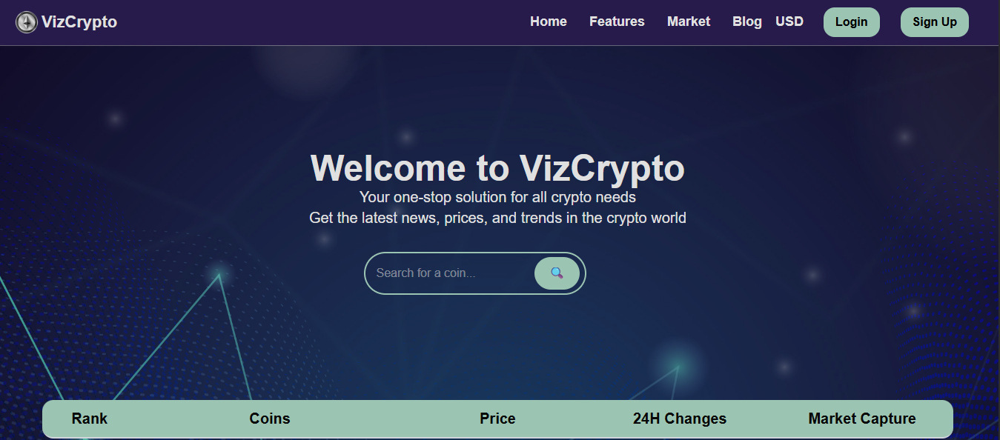
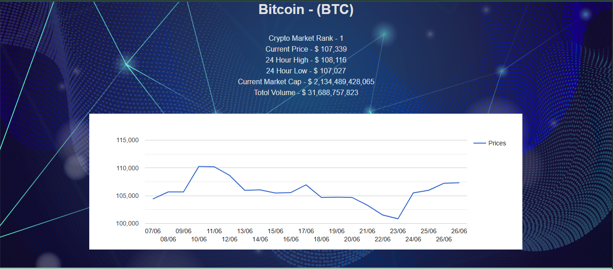

# VizCrypto - Cryptocurrency Visualizer


VizCrypto is a modern, responsive cryptocurrency tracking and visualization web application built with React and Vite. Get real-time crypto market data, track price movements, and visualize trends with interactive charts.

## 🚀 Features

- **Real-time Market Data**: Live cryptocurrency prices and market information powered by CoinGecko API
- **Interactive Charts**: Visualize price trends over the last 20 days with Google Charts integration
- **Multi-Currency Support**: View prices in USD, EUR, and INR
- **Search Functionality**: Quick search and filter through hundreds of cryptocurrencies
- **Responsive Design**: Mobile-first design with Tailwind CSS for optimal viewing on all devices
- **Detailed Coin Information**: Individual coin pages with comprehensive market data including:
  - Current price and market cap
  - 24-hour high/low prices
  - Market cap ranking
  - Trading volume
  - Price change percentages

## 🛠️ Tech Stack

- **Frontend**: React 18, JSX
- **Build Tool**: Vite
- **Routing**: React Router DOM
- **Styling**: Tailwind CSS, Custom CSS
- **Charts**: React Google Charts
- **State Management**: React Context API
- **API**: CoinGecko API
- **Development Tools**: ESLint, Vite HMR

## 📦 Installation

1. **Clone the repository**

   ```bash
   git clone https://github.com/yourusername/crypto-visualiser.git
   cd crypto-visualiser
   ```

2. **Install dependencies**

   ```bash
   npm install
   ```

3. **Start the development server**

   ```bash
   npm run dev
   ```

## 🎯 Usage

### Home Page

- Browse the top 10 cryptocurrencies by market cap
- Use the search bar to find specific cryptocurrencies
- View real-time prices, 24h changes, and market cap
- Switch between different currencies (USD, EUR, INR)

### Coin Details Page

- Click on any cryptocurrency to view detailed information
- See historical price charts for the last 20 days
- Access comprehensive market data and statistics

### Currency Switching

- Use the dropdown in the header to switch between USD, EUR, and INR
- All prices and charts update automatically

## 📁 Project Structure

```
crypto-visualiser/
├── public/
│   └── vite.svg
├── src/
│   ├── assets/          # Images and static assets
│   ├── components/      # Reusable UI components
│   │   ├── Header/      # Navigation and currency selector
│   │   ├── Footer/      # Footer component
│   │   └── LineChart/   # Chart visualization component
│   ├── context/         # React Context for state management
│   │   └── CoinContext.jsx
│   ├── pages/           # Main application pages
│   │   ├── Home/        # Homepage with coin list
│   │   └── Coin/        # Individual coin details
│   ├── App.jsx          # Main application component
│   ├── main.jsx         # Application entry point
│   └── index.css        # Global styles
├── package.json
├── vite.config.js
└── README.md
```

## 🔧 Available Scripts

- `npm run dev` - Start development server
- `npm run build` - Build for production
- `npm run preview` - Preview production build
- `npm run lint` - Run ESLint

## 🌐 API Integration

This project uses the [CoinGecko API](https://www.coingecko.com/en/api) to fetch:

- Market data for cryptocurrencies
- Historical price data
- Coin images and metadata

**Note**: The application includes a demo API key. For production use, consider getting your own API key from CoinGecko.

## 🎨 Styling

The application uses a combination of:

- **Tailwind CSS**: For utility-first styling and responsive design
- **Custom CSS**: For component-specific styles and animations
- **Responsive Design**: Mobile-first approach ensuring compatibility across devices

## Screenshots
### Screenshot






For questions, suggestions, or support, please reach out:

- Create an issue on GitHub
- Email: work.sagarsaini@example.com

---

**VizCrypto** - Your one-stop solution for all crypto needs. Get the latest news, prices, and trends in the crypto world! 🚀
